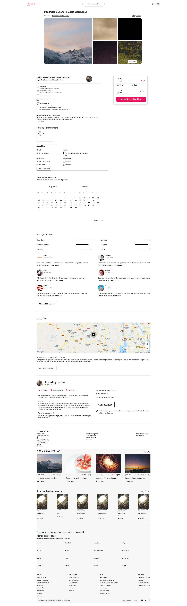

# Photos Service for Airbrb

> This service is composed of a photo grid and album and a top bar that pulls from the reviews and location services. The number of reviews and average rating is pulled from the reviews service. The location information is pulled from the location service.

## Components

> The following is an example of the photo service with succesful calls to each microservice and to the database for the photos
> 

> The following is an error-handled scenario where calls to the dependent services and to the database failed

> 

## FUll PROXY

> Below is all of the microservices rendered on a proxy, as a member of the team I was in charge of the "About" section and footer.
> 

## Related Projects

- https://github.com/Wilberg-Airbnb/description
- https://github.com/Wilberg-Airbnb/reservation
- https://github.com/Wilberg-Airbnb/reviews
- https://github.com/Wilberg-Airbnb/location
- https://github.com/Wilberg-Airbnb/host
- https://github.com/Wilberg-Airbnb/suggestion

## Table of Contents

1. [Usage](#Usage)

## Usage

> Some usage instructions:

> 1.  "npm install" to install all of the dependcies
> 2.  Running Webpack: "npm run react-dev",
> 3.  Seeding the database: "npm run seed"
> 4.  Running the Server: "npm run server"
> 5.  Port number: 3001
> 6.  Navigate to http://localhost:3001/${Listing between 0 - 99}/
